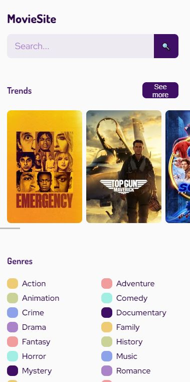

# MovieSite

I use this project from a Platzi course to learn about how to work with APIs.
It has no GitHub Pages neither responsive for desktop.
If you want to test it you have to create an API KEY in "themoviedb.org" and put it in "./src/secrets.example.js".
Images 29/05/2022:

